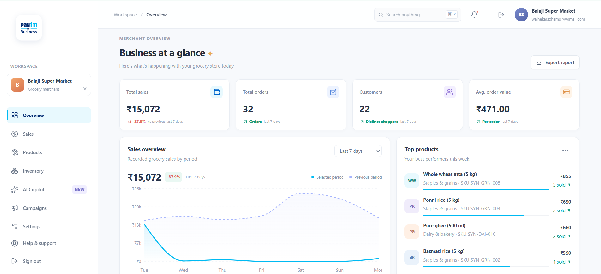
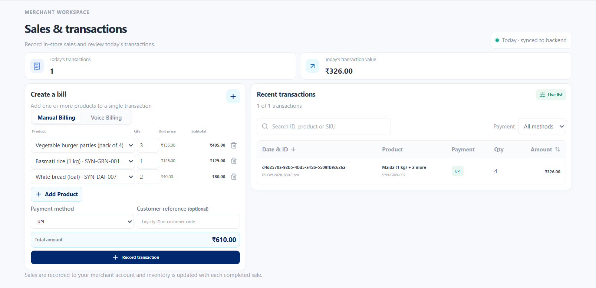
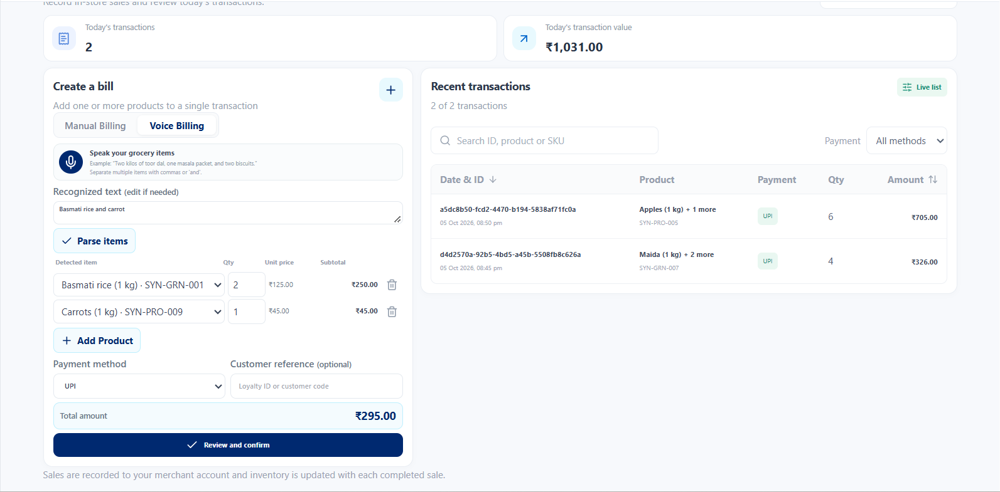
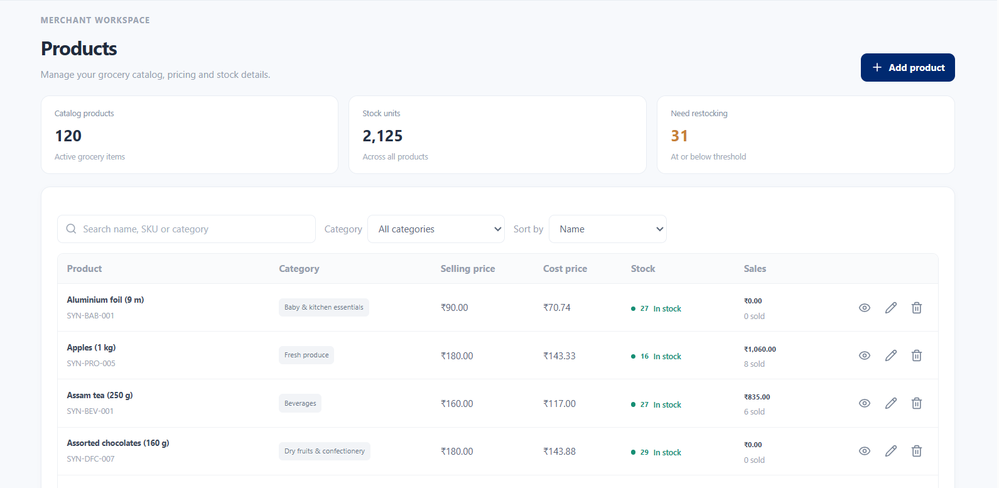
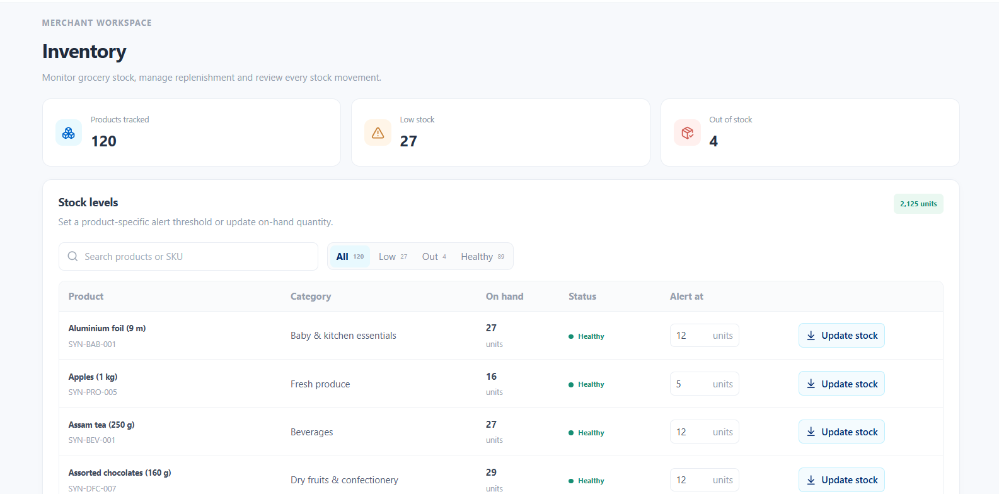
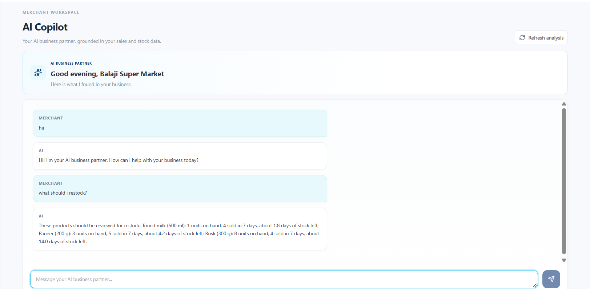

# Paytm Merchant AI Business Copilot

The Paytm Merchant AI Business Copilot is a full-stack AI-powered business assistant designed to help small and medium-sized merchants understand their business, increase sales, manage inventory, and make better operational decisions.

The platform goes beyond payments by combining merchant sales, products, inventory, customers, and campaigns into a unified business intelligence layer. An AI Copilot uses this business context to answer merchant questions, identify growth opportunities, and recommend actionable next steps.

Built with a React + Vite frontend, FastAPI backend, PostgreSQL on Neon, SQLAlchemy, and an AI/LLM layer, the project demonstrates an end-to-end merchant intelligence workflow: transaction capture, voice billing, business analytics, inventory intelligence, AI-powered recommendations, and conversational business assistance.

## Live Demo

**Link**: Add your deployed application URL here.

For testing purposes, use the merchant account registered through the application.

The application includes a sample grocery-store dataset for **Balaji Super Market**, including products, transactions, inventory movements, and campaigns.

## Screenshots

### Merchant Overview Dashboard



### Sales & Billing



### Voice Billing



### Products & Inventory




### AI Business Copilot




## Highlights

- **AI Business Copilot**: Conversational AI assistant that understands merchant sales, products, inventory, customers, and business opportunities.
- **Merchant-aware AI**: Responses are grounded in the authenticated merchant's actual business data.
- **Business intelligence**: Analyze sales trends, transaction volume, average order value, product performance, and customer activity.
- **Period-based analytics**: View dashboard analytics for the last 7 days, last 30 days, or last 12 months.
- **Multi-product billing**: Record a complete customer purchase as one transaction containing multiple products.
- **Voice billing**: Merchants can speak naturally, such as "Two kilos of toor dal, one masala packet and two biscuits," and convert it into a structured transaction.
- **Product matching**: Voice billing matches spoken products with the merchant's product catalogue and retrieves saved prices.
- **Inventory management**: Sales automatically update inventory while inventory movements maintain stock history.
- **Top-product analytics**: Identify the best-performing products for the selected business period.
- **Growth opportunities**: Detect sales changes, fast-moving products, slow-moving products, low-stock opportunities, and other business signals.
- **Campaign intelligence**: Identify products and situations where promotions may help increase sales.
- **Today's transactions**: The Sales page focuses on the merchant's current-day transactions.
- **Merchant data isolation**: Business data and AI context are scoped to the authenticated merchant.
- **Grounded AI architecture**: Database queries calculate business facts while the AI explains those facts and generates recommendations.

## Demo Workflow

1. A merchant registers through the merchant portal and signs in.
2. Products, sales, inventory, and campaign data are stored in PostgreSQL.
3. The merchant records a sale manually or uses Voice Billing.
4. Multiple products can be added to a single transaction.
5. The backend records transaction items and updates inventory.
6. The Overview dashboard aggregates business data according to the selected period.
7. The AI Copilot retrieves relevant merchant context from the database.
8. The merchant can ask questions such as:
   - "How are my sales?"
   - "What are my top products?"
   - "What should I restock?"
   - "Which products are selling slowly?"
   - "How can I increase sales?"
9. The AI analyzes the relevant business context and generates a merchant-specific response.
10. Recommendations can be connected to controlled merchant actions such as campaigns and inventory operations.

## Tech Stack

| Layer | Tools |
| --- | --- |
| Frontend | React, Vite, JavaScript/TypeScript, CSS |
| Backend | FastAPI, Python, Pydantic, SQLAlchemy |
| Database | PostgreSQL, Neon |
| Authentication | JWT-based merchant authentication |
| AI / LLM | Groq / LLM integration |
| Analytics | PostgreSQL aggregation, Python analytics |
| Voice Billing | Browser speech-to-text, product/entity matching |
| API | REST APIs |
| Deployment | Configurable for Vercel, Render, Railway, or AWS |

## Architecture

```text
Merchant Web App (React + Vite)
        |
        | REST API + Authentication
        v
FastAPI Backend
        |
        |-- Authentication & merchant isolation
        |-- Sales APIs
        |-- Product APIs
        |-- Inventory APIs
        |-- Campaign APIs
        |-- AI Copilot APIs
        |-- Voice Billing
        |
        v
PostgreSQL / Neon
        |
        |-- Merchants
        |-- Products
        |-- Transactions
        |-- Transaction Items
        |-- Inventory Movements
        |-- Campaigns
        |
        v
Business Analytics Layer
        |
        |-- Sales trends
        |-- Product performance
        |-- Customer insights
        |-- Inventory intelligence
        |-- Growth opportunities
        |
        v
AI Copilot
        |
        |-- Intent understanding
        |-- Merchant context
        |-- Business analysis
        |-- Recommendations
        |-- Conversational responses
        |
        v
Merchant Actions
        |
        |-- View insights
        |-- Record sales
        |-- Manage inventory
        |-- Create campaigns
        |-- Execute recommended actions
